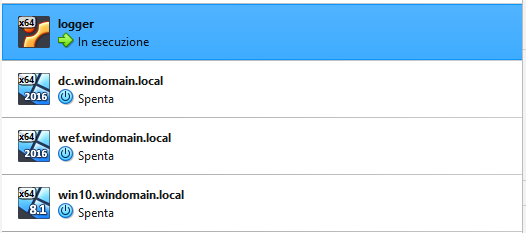
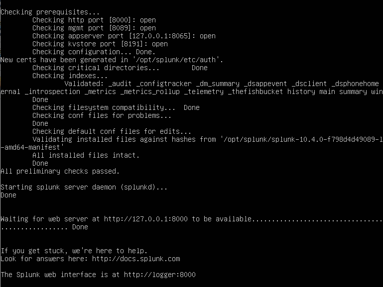

# 📁 01-Environment-Setup: Provisioning dell'Infrastruttura SOC

## 🎯 Obiettivo della Fase
Progettare e implementare un ambiente di virtualizzazione multi-host isolato (Sandbox) per simulare una rete aziendale Active Directory, configurando un server SIEM centrale per la raccolta dei log.

### 🖼️ Stato dell'Hypervisor (VirtualBox)
Qui di seguito viene documentato lo stato di esecuzione della macchina centralizzatrice Linux all'interno dell'Hypervisor:



## 📐 Architettura della Rete (Detection Lab)
L'ambiente è basato sul framework Detection Lab ed è orchestrato tramite **Vagrant** su Hypervisor **Oracle VM VirtualBox**. La rete virtuale utilizza una subnet privata in modalità Host-Only (`192.168.56.0/24`).


| Nome Host | Indirizzo IP | Sistema Operativo | Ruolo nel Laboratorio |
| :--- | :--- | :--- | :--- |
| **`logger`** | `192.168.56.105` | Ubuntu Linux 20.04 | Server SIEM centrale (Splunk Enterprise) |
| **`dc-prod`** | `192.168.56.102` | Windows Server 2016 | Domain Controller (Active Directory centrale) |
| **`wef`** | `192.168.56.103` | Windows Server 2016 | Windows Event Collector (Collettore di log) |
| **`win10-client`** | `192.168.56.104` | Windows 10 Enterprise | Endpoint della vittima (Postazione dipendente) |

---

## 🛠️ Comandi Operativi di Gestione & Start-up del Servizio
Per ovviare ai conflitti di lock della memoria di sistema (`E_ACCESSDENIED`), l'avvio della macchina è stato eseguito via GUI, mentre il servizio Splunkd interno è stato forzato via CLI superando le restrizioni di sicurezza del root:

```bash
# Comando di forzatura avvio demone Splunk Enterprise su Ubuntu
/opt/splunk/bin/splunk start --accept-license --run-as-root
```



## 🔍 Convalida dell'Ambiente
L'ambiente è stato validato verificando l'accessibilità della console web di Splunk Enterprise dall'host reale all'indirizzo `http://192.168.56.105:8000`, certificando il corretto funzionamento del server Apache/Splunkd in background su Linux.
