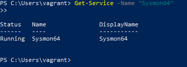

# 📁 02-Sysmon-Installation: Configurazione Avanzata della Telemetria Endpoint

## 🎯 Obiettivo della Fase
Implementare un sistema di monitoraggio e tracciamento dei processi a livello kernel (EDR-style) sull'endpoint della vittima, ottimizzando la generazione dei log per eliminare il rumore di fondo del sistema operativo Windows.

## 🔍 Il Ruolo di Microsoft Sysmon (System Monitor)
Mentre i registri standard di Windows (Security Event Logs) si limitano a registrare eventi generici come il login, **Sysmon** monitora le attività profonde del sistema operativo. Genera telemetria critica per identificare le minacce, tra cui:
- **EventID 1**: Creazione di nuovi processi (traccia i programmi eseguiti e i comandi digitati).
- **EventID 3**: Connessioni di rete TCP/UDP avviate da applicazioni locali.
- **EventID 7**: Caricamento di moduli e librerie DLL (fondamentale per intercettare l'iniezione di codice).

---

## 🛠️ Procedura di Installazione & Ottimizzazione (SwiftOnSecurity)
Lanciare Sysmon con le impostazioni di default causerebbe un sovraccarico di dati inutili (rumore di fondo come movimenti del mouse o file temporanei del browser), intasando la memoria del SIEM. 

Per risolvere questo problema, l'agente è stato accoppiato con il file di configurazione avanzato di **SwiftOnSecurity**, un dizionario XML che istruisce Sysmon a ignorare le attività legittime di Windows e a concentrarsi esclusivamente sulle anomalie e sulle tecniche di attacco note (MITRE ATT&CK).

I comandi eseguiti in PowerShell con privilegi elevati (Amministratore) per completare l'operazione sono:

```powershell
# Spostamento nella directory dei binari di setup
cd C:\SysmonSetup

# Installazione nativa a 64-bit e applicazione del file di configurazione filtrato
.\Sysmon64.exe -i sysmonconfig-export.xml -acceptlicense
```

## 🔍 Convalida del Servizio
Il successo dell'installazione è stato verificato interpellando direttamente il Service Controller di Windows per accertarsi che il driver a livello kernel fosse attivo e in esecuzione persistente:

```powershell
Get-Service -Name "Sysmon64"
```

### 🖼️ Evidenza Forense del Servizio Attivo
Di seguito viene allegata la prova digitale del corretto funzionamento dell'agente Sysmon sull'host Windows:


