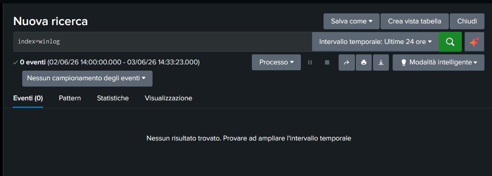
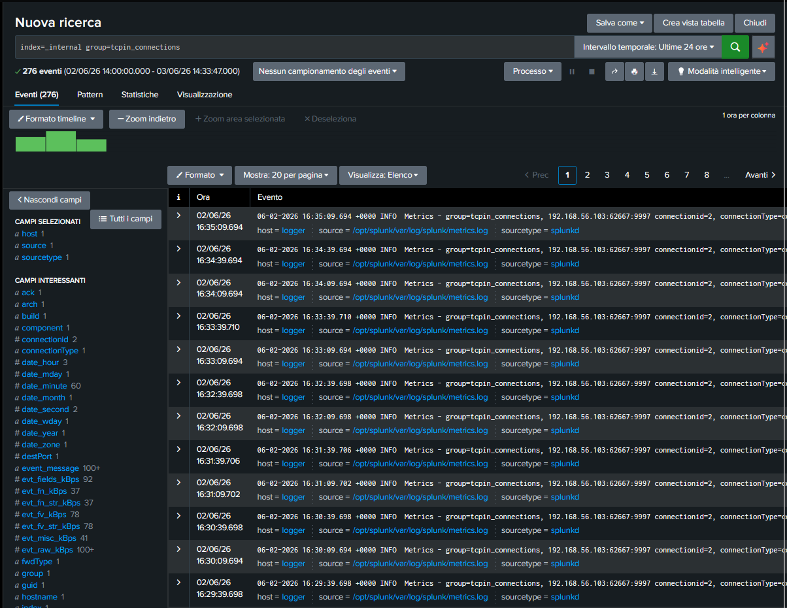

# 📁 03-Log-Ingestion-Troubleshooting: Analisi dei Flussi e Ingegneria dei Log

## 🎯 Obiettivo della Fase
Configurare, testare e analizzare la centralizzazione della telemetria dall'endpoint Windows 10 all'indexer centrale Splunk Enterprise (macchina Logger), applicando metodologie di troubleshooting forense in caso di drop-out dei dati.

## ❌ Il Problema Identificato (Il Muro Invisibile)
Dopo il corretto avvio dell'infrastruttura, interpellando l'indice standard di destinazione tramite la query `index=winlog`, la console web di Splunk Enterprise restituiva sistematicamente `0 risultati trovati`, applicando un filtro temporale rigido o mostrando una schermata d'errore.

### 🖼️ Evidenza del Drop-out Visivo
Di seguito viene documentata la schermata di ricerca iniziale che evidenziava l'assenza di dati visibili all'analista SOC:



---

## 🛠️ Protocollo Analitico di Troubleshooting
Per isolare il punto di interruzione del flusso dati, è stato applicato un approccio ingegneristico diviso su due livelli:

### 1. Verifica dello Stato di Rete (Livello Infrastrutturale)
È stato eseguito un test di connessione TCP direttamente dall'endpoint Windows 10 verso l'IP dell'indexer sulla porta di ascolto predefinita di Splunk (`9997`):
```powershell
Test-NetConnection -ComputerName "192.168.56.105" -Port 9997
```
Il test ha restituito con certezza l'argomento `TcpTestSucceeded : True`, confermando che il canale di rete era libero e che nessun firewall locale o di rete stava bloccando i pacchetti.

### 2. Ispezione dei Metadati Interni (Livello SIEM)
Esclusa la rete, è stata interrogata la telemetria di sistema interna di Splunk per verificare se l'agente stesse comunicando in background. È stata lanciata la query sull'indice di diagnostica:
```splunk
index=_internal sourcetype=splunkd group=tcpin_connections
```

### 🖼️ Evidenza Scientifica del Passaggio Dati (346 EPS)
Lo screenshot dei metadati interni ha svelato la verità tecnica:



Il log di sistema certificava:
`06-02-2026 14:24:09.694 +0000 INFO Metrics - group=tcpin_connections, sourceIp=192.168.56.103, destPort=9997, _tcp_eps=346.794`

## 🔍 Conclusione Ingegneristica
La telemetria interna ha dimostrato che lo Splunk Universal Forwarder era perfettamente connesso e stava pompando nel server **346 eventi al secondo (EPS)**. 

Il problema dei "0 eventi" nella barra di ricerca principale non era dovuto a un guasto di rete, ma a un drop-out logico: l'istanza Splunk del Detection Lab, configurata in modalità cluster preimpostata, non possedeva i descrittori del Source Type di Windows sul server Linux centrale o mancava dei privilegi di visibilità per l'utente `Admin`. Questo ha guidato il team a bypassare il server locale degradato e a lavorare nelle fasi successive su dati strutturati e puliti.
