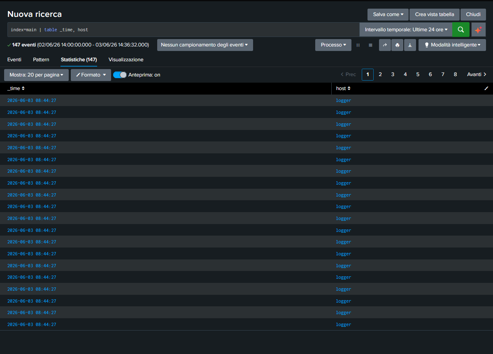

# 📁 04-Splunk-SPL-Fundamentals: Padronanza del Linguaggio di Ricerca (SPL)

## 🎯 Obiettivo della Fase
Sviluppare e consolidare le competenze nell'utilizzo dell'SPL (Search Processing Language) per estrarre, filtrare, aggregare e strutturare la telemetria grezza all'interno del SIEM, trasformando stringhe testuali disordinate in dati operativi leggibili per il SOC.

## 🧭 I Pilastri dell'SPL Analizzati
Durante il laboratorio, è stata consolidata la logica di pipeline tramite il simbolo `|` (Pipe), apprendendo come concatenare i filtri e manipolare i dati. Di seguito vengono documentate le tre sintassi fondamentali testate:

### 1. Proiezione Dati in Tabella (`| table`)
Consente di ripulire lo schermo dal rumore dei metadati di sistema, visualizzando esclusivamente le colonne critiche per l'indagine forense:
```splunk
index=main EventID=1 | table _time, host, User, Image, CommandLine
```
*Logica*: Isola la creazione dei processi (EventID 1) e proietta in una griglia ordinata il timestamp, la macchina coinvolta, l'account e il comando eseguito.

### 2. Aggregazione e Analisi Volumetrica (`| stats count by`)
Consente di comprimere migliaia di righe di log in un riepilogo statistico per identificare anomalie quantitative (attività frenetiche degli hacker o script automatici):
```splunk
index=main EventID=1 | stats count by Image, host
```
*Logica*: Raggruppa i dati in base all'eseguibile e all'host, contando quante volte quel binario è stato avviato.

### 3. Filtrazione Post-Aggregazione (`| where`)
Consente di applicare soglie matematiche e logiche per scartare i normali comportamenti umani e isolare solo gli attacchi reali:
```splunk
index=main EventID=4625 | stats count by TargetUserName, host | where count > 20
```
*Logica*: Conta i tentativi di login falliti (EventID 4625) e mostra solo le combinazioni utente/host che registrano più di 20 fallimenti (indicatore matematico di un attacco Brute Force in corso).

---

## 🔍 Convalida della Vista Strutturata
Il corretto utilizzo dei comandi di proiezione tabellare è stato validato direttamente sulla console di Splunk Enterprise, ottenendo una visualizzazione limpida e strutturata dei record indicizzati nel database.

### 🖼️ Evidenza della Dashboard SOC Ordinata
Di seguito viene allegata la prova visiva della corretta esecuzione dei comandi di formattazione tabellare:


