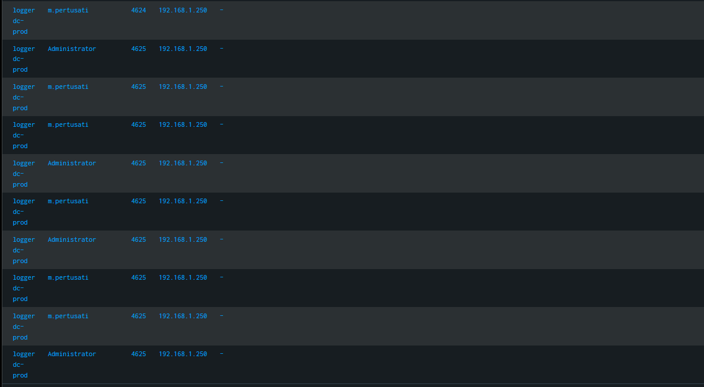

# 📁 05-Threat-Hunting-Base: Triage e Analisi della Catena di Attacco (Kill Chain)

## 🎯 Obiettivo della Fase
Analizzare la telemetria di un endpoint compromesso per identificare le fasi iniziali di un'intrusione informatica, tracciando le attività di Brute Force e la ricognizione iniziale (Discovery) eseguita dall'attaccante.

## 🕵️‍♂️ Investigazione 1: Identificazione del Vettore di Intrusione
Interrogando la telemetria tramite la console di Splunk Enterprise, è stata isolata una massiccia anomalia volumetrica legata a tentativi di autenticazione falliti:
- **Tecnica MITRE ATT&CK**: Password Spraying / Brute Force (Windows EventID 4625).
- **Account Bersaglio**: `Administrator` e `m.pertusati`.
- **Origine della Minaccia (Sorgente Maligna)**: Indirizzo IP esterno `192.168.1.250` operante sul Domain Controller (`dc-prod`).

Il monitoraggio cronologico evidenzia una raffica di fallimenti interrotta da un singolo evento **EventID 4624 (Login Riuscito)** alle ore 08:01:46, confermando la compromissione dell'account dell'utente `m.pertusati`.

### 🖼️ Evidenza Forense del Triage Iniziale
Di seguito viene allegato lo screenshot della timeline dei log che ha permesso di mappare il brute force e il successivo movimento laterale verso l'host client:

---

## 🕵️‍♂️ Investigazione 2: Tracciamento delle Attività di Discovery (EventID 1)
Subito dopo aver ottenuto l'accesso, l'attaccante ha avviato una sessione interattiva di riga di comando (`cmd.exe`) sull'host `win10-client` per studiare la struttura della rete aziendale. Sono stati intercettati i seguenti comandi critici:
- `cmd.exe /c whoami /all` ➔ Eseguito dall'attaccante per mappare i propri privilegi e gruppi di appartenenza locali.
- `net user /domain` ➔ Enumerazione totale di tutti gli account utente registrati nel database Active Directory.
- `net localgroup administrators` ➔ Identificazione dei profili utente dotati di privilegi amministrativi locali sulla macchina.
- `tasklist` ➔ Mappatura dei processi attivi per identificare la presenza di agenti antivirus o software di EDR (Endpoint Detection and Response).
