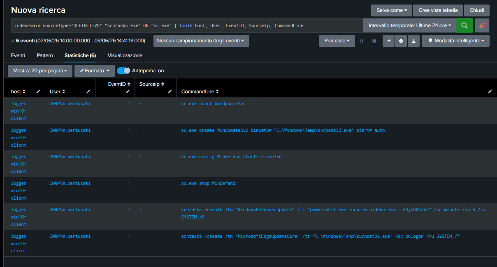

# 📁 07-Persistence-Detection: Rilevamento dei Meccanismi di Persistenza e Masquerading

## 🎯 Obiettivo della Fase
Identificare, analizzare e documentare le tecniche utilizzate dall'attaccante per mantenere l'accesso persistente all'infrastruttura aziendale superando i riavvii dei sistemi, e tracciare le manovre di disattivazione delle difese locali.

## 🕵️‍♂️ Investigazione 1: Disattivazione delle Difese (Defense Evasion)
Interrogando la telemetria legata all'utility nativa di gestione dei servizi di Windows (`sc.exe`), è stato rilevato il totale accecamento dell'antivirus locale sulla macchina della vittima alle ore 08:04:30:
- `sc.exe stop WinDefend` ➔ Arresto forzato del servizio di Windows Defender Core.
- `sc.exe config WinDefend start= disabled` ➔ Modifica della configurazione del registro per impedire il riavvio automatico dell'antivirus al boot successivo.

---

## 🕵️‍♂️ Investigazione 2: Creazione di Servizi e Task Maligni (Persistenza)
L'attaccante ha tentato di camuffare la propria presenza utilizzando nomi che ricalcano processi legittimi di Microsoft (Tecnica MITRE: **Masquerading**), ma il triage ha svelato l'anomalia grazie al percorso di esecuzione isolato nella cartella temporanea `Temp`:

### 1. Abuso del Service Controller (`sc.exe`)
È stato creato un servizio di sistema fraudolento denominato **`WinUpdateSvc`** configurato per eseguire un binario maligno in background in modalità persistente:
- **Comando**: `sc.exe create WinUpdateSvc binPath= "C:\Windows\Temp\svchost32.exe" start= auto`
- **Anomalia**: Il nome simula il Windows Update, ma punta a un eseguibile arbitrario situato in una directory ad alto rischio (`\Temp\`).

### 2. Abuso delle Attività Pianificate (`schtasks.exe`)
Per garantire la ridondanza della persistenza, l'attaccante ha configurato due attività pianificate:
- **Task 1 (`MicrosoftEdgeUpdateCore`)**: Configurato per forzare l'esecuzione periodica del binario `C:\Windows\Temp\svchost32.exe`.
- **Task 2 (`WindowsDefenderUpdate`)**: Configurato per richiamare uno script PowerShell occultato con payload cifrato Base64 (`JABjAG0AZA=...`).

### 🖼️ Evidenza Forense della Persistenza Stanata
Di seguito viene allegata la telemetria di Splunk Enterprise che ha permesso di mappare ed esporre la configurazione dei persistency tool dell'hacker:

