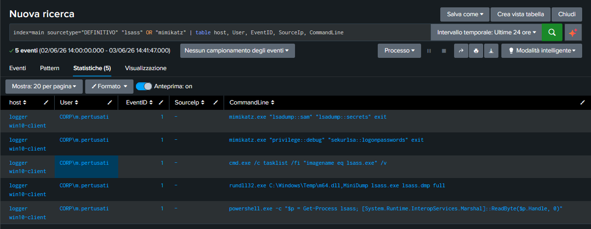

# 📁 08-Credential-Theft-Forensics: Analisi dell'Attacco alla Memoria LSASS e Mimikatz

## 🎯 Obiettivo della Fase
Rilevare, analizzare e documentare i tentativi di estrazione e furto delle credenziali d'accesso degli amministratori memorizzate all'interno della memoria di sicurezza di Windows.

## 🕵️‍♂️ Investigazione 1: Il Process Memory Dump (LSASS Attack)
L'attaccante ha preso di mira il processo di sistema fondamentale **`lsass.exe`** (Local Security Authority Subsystem Service), il quale custodisce in memoria le credenziali degli utenti connessi. 

Per eludere i controlli dell'antivirus, non ha attaccato direttamente il processo, ma ha sfruttato un binario nativo legittimo di Windows (`rundll32.exe`) accoppiato a una DLL di debug posizionata nella cartella temporanea, effettuando una copia speculare (dump completo) della memoria:
- **Comando Intercettato**: `rundll32.exe C:\Windows\Temp\m64.dll,MiniDump lsass.exe lsass.dmp full`
- **Impatto**: Il file risultante `lsass.dmp` contiene i segreti dell'Active Directory estratti dalla RAM e depositati sul disco pronti per la decifrazione offline.

---

## 🕵️‍♂️ Investigazione 2: Estrazione dei Segreti con Mimikatz
Una volta ottenuto il file di dump della memoria, l'attaccante ha invocato lo strumento di post-sfruttamento **Mimikatz** per estrarre le chiavi in chiaro. La telemetria ha isolato due sequenze di comandi distinte:

1. **Abuso dei Privilegi di Sistema**:
   - `mimikatz.exe "privilege::debug" "sekurlsa::logonpasswords" exit`
   - *Analisi*: `privilege::debug` forza lo sblocco dei permessi di programmatore per interagire con i processi di sistema, mentre `sekurlsa::logonpasswords` decifra il dump della memoria estraendo le **password in chiaro** (in formato testo non cifrato) degli amministratori di rete.

2. **Dump dei Database delle Password locali**:
   - `mimikatz.exe "lsadump::sam" "lsadump::secrets" exit`
   - *Analisi*: Estrazione forzata del database SAM locale per ottenere gli hash delle password offline memorizzate sull'host.

### 🖼️ Evidenza Forense del Furto di Credenziali
Di seguito viene allegata l'evidenza di Splunk Enterprise che documenta l'esatta esecuzione dei comandi di Mimikatz e Rundll32 intercettati sulla macchina:

