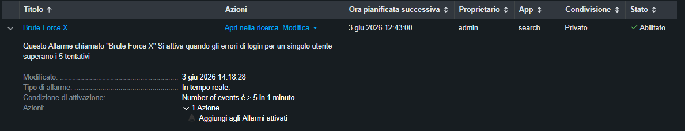

# 📁 09-SOC-Automation: Ingegneria dei Rilevamenti e Alerting in Tempo Reale

## 🎯 Obiettivo della Fase
Progettare, implementare e ottimizzare una regola di monitoraggio automatica (Alerting Rule) all'interno di Splunk Enterprise per rilevare e mitigare tempestivamente attacchi di forza bruta futuri senza l'intervento manuale dell'analista.

## 🔍 Sviluppo della Query Analitica (Soglia Volumetrica)
Per intercettare attacchi di tipo Password Spraying o Brute Force (EventID 4625) escludendo i normali errori umani di digitazione, è stata creata una query basata su una soglia quantitativa rigida tramite i comandi SPL `stats` e `where`:

```splunk
index=main EventID=4625 | stats count by User, SourceIp | where count > 5
```

---

## 🛠️ Configurazione dei Parametri dell'Allarme
La query è stata salvata e convertita in un **Allarme in tempo reale (Real-time Alert)** per garantire la massima reattività difensiva. 

### ⚙️ Ottimizzazione Ingegneristica (Throttling & Suppression)
Durante la configurazione è stato applicato il protocollo di limitazione degli allarmi (Throttling) per evitare il sovraccarico della console del SOC in caso di attacchi automatici massivi (Alert Fatigue):
- **Condizione di Innesco**: Il numero di risultati è maggiore di 5 in 1 minuto.
- **Limitazione basata sul campo (Throttle by field)**: `SourceIp`. Splunk raggruppa le notifiche per indirizzo IP attaccante.
- **Inibizione dell'attivazione (Suppression)**: Configurato a `5 minuti`. Una volta attivato per un determinato IP, l'allarme viene silenziato per i successivi 5 minuti per lo stesso host maligno.
- **Azione**: Registrazione persistente nella dashboard degli "Allarmi attivati" con severità impostata su **Alta** (High Severity).

### 🖼️ Evidenza Forense dell'Allarme Attivo nel SIEM
Di seguito viene allegata la scheda tecnica ufficiale che certifica il corretto salvataggio e l'attivazione della regola di monitoraggio automatico nel cervello di Splunk Enterprise:


