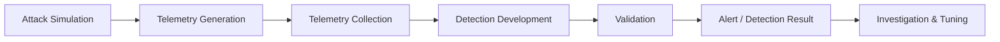

# Advanced Detection Engineering & Threat Hunting Lab

A practical detection engineering portfolio focused on attack simulation, security telemetry, SIEM detection development, validation, and cross-platform rule portability.

The project covers the full detection lifecycle:

**Attack Simulation → Telemetry → Detection → Alert → Investigation → Validation**

Detection logic is implemented across multiple formats and platforms, primarily:

* Splunk SPL
* Microsoft Sentinel KQL
* Sigma
* MITRE ATT&CK

The detections were developed and validated in a controlled laboratory environment based on Windows and Linux telemetry.

> **Repository scope:** This repository contains detection engineering artifacts, validation documentation, dashboards, and supporting documentation. The complete virtual laboratory infrastructure, virtual machines, credentials, provisioning files, and production data are not included.

---

## Project Overview

The project contains **22 detection scenarios**:

* **17 atomic detections**
* **5 multi-stage correlation detections**

The atomic detections cover behaviors across:

* Execution
* Persistence
* Privilege Escalation
* Defense Evasion
* Credential Access
* Discovery
* Lateral Movement
* Impact

The correlation detections combine multiple telemetry events to identify multi-stage attack activity.

---

## Project Metrics

| Metric                    |           Coverage |
| ------------------------- | -----------------: |
| Total Detection Scenarios |             **22** |
| Atomic Detections         |             **17** |
| Correlation Detections    |              **5** |
| SPL Implementations       |             **22** |
| KQL Implementations       |             **17** |
| Sigma Rules               |             **17** |
| Validation Reports        |             **22** |
| MITRE ATT&CK Techniques   |           Multiple |
| Primary SIEM              |  Splunk Enterprise |
| Secondary Query Platform  | Microsoft Sentinel |
| Portable Detection Format |              Sigma |

The repository also contains a Splunk dashboard and documentation covering the laboratory architecture, threat model, detection methodology, and validation process.

---

# Detection Coverage

## Atomic Detections

The following 17 scenarios represent individually testable detection rules.

| ID      | Detection                        | MITRE ATT&CK | SPL | KQL | Sigma |
| ------- | -------------------------------- | ------------ | :-: | :-: | :---: |
| DET-001 | Encoded PowerShell Command       | T1059.001    |  ✅  |  ✅  |   ✅   |
| DET-002 | Local User Creation              | T1136.001    |  ✅  |  ✅  |   ✅   |
| DET-003 | Privilege Escalation             | T1548.002    |  ✅  |  ✅  |   ✅   |
| DET-004 | Windows Defender Evasion         | T1562.001    |  ✅  |  ✅  |   ✅   |
| DET-005 | Scheduled Task Persistence       | T1053.005    |  ✅  |  ✅  |   ✅   |
| DET-006 | LSASS Credential Dumping         | T1003.001    |  ✅  |  ✅  |   ✅   |
| DET-007 | PsExec Lateral Movement          | T1569.002    |  ✅  |  ✅  |   ✅   |
| DET-008 | Windows Firewall Manipulation    | T1562.004    |  ✅  |  ✅  |   ✅   |
| DET-009 | Clearing Windows Event Logs      | T1070.001    |  ✅  |  ✅  |   ✅   |
| DET-010 | RDP Session Hijacking            | T1563.002    |  ✅  |  ✅  |   ✅   |
| DET-016 | Local & Domain Reconnaissance    | TA0007       |  ✅  |  ✅  |   ✅   |
| DET-017 | Kerberoasting                    | T1558.003    |  ✅  |  ✅  |   ✅   |
| DET-018 | Linux SUID Privilege Escalation  | T1548.001    |  ✅  |  ✅  |   ✅   |
| DET-019 | WMI Lateral Movement & Execution | T1047        |  ✅  |  ✅  |   ✅   |
| DET-020 | Token Impersonation              | T1134.001    |  ✅  |  ✅  |   ✅   |
| DET-021 | Inhibit System Recovery          | T1490        |  ✅  |  ✅  |   ✅   |
| DET-022 | Rundll32 Proxy Execution         | T1218.011    |  ✅  |  ✅  |   ✅   |

---

## Correlation Detections

Five additional detections correlate multiple events or behaviors to identify a broader attack sequence.

| ID      | Scenario                                         | Implementation | Validation |
| ------- | ------------------------------------------------ | -------------- | :--------: |
| COR-001 | Domain Compromise Correlation                    | SPL            |      ✅     |
| COR-002 | Credential Theft Correlation                     | SPL            |      ✅     |
| COR-003 | Lateral Persistence Correlation                  | SPL            |      ✅     |
| COR-004 | Ransomware / Data Destruction Correlation        | SPL            |      ✅     |
| COR-005 | Suspicious Office-to-Shell Execution Correlation | SPL            |      ✅     |

Correlation detections are intentionally separated from atomic detections because they require multiple events or stages rather than a single behavioral indicator.

---

# MITRE ATT&CK Coverage

The project maps detection scenarios to MITRE ATT&CK tactics and techniques.

| Tactic               | Tactic ID | Detection Coverage                                         |
| -------------------- | --------- | ---------------------------------------------------------- |
| Initial Access       | TA0001    | Limited                                                    |
| Execution            | TA0002    | PowerShell, WMI, Rundll32                                  |
| Persistence          | TA0003    | Scheduled Tasks, User Creation                             |
| Privilege Escalation | TA0004    | Privilege Escalation, SUID, Token-related activity         |
| Defense Evasion      | TA0005    | Defender Evasion, Firewall Manipulation, Log Clearing      |
| Credential Access    | TA0006    | LSASS Dumping, Kerberoasting                               |
| Discovery            | TA0007    | Local and Domain Reconnaissance                            |
| Lateral Movement     | TA0008    | PsExec, WMI, RDP-related activity                          |
| Collection           | TA0009    | Limited                                                    |
| Command and Control  | TA0011    | Limited                                                    |
| Exfiltration         | TA0010    | Correlation coverage requires additional network telemetry |
| Impact               | TA0040    | Inhibit System Recovery / destructive activity             |

> ATT&CK mappings describe the intended behavioral coverage of the detection rules. They should not be interpreted as complete coverage of the corresponding tactic or technique.

---

# Validation Methodology

Detection validation is performed in a controlled laboratory environment.

The validation process follows:

```text
Attack Simulation
       ↓
Telemetry Generation
       ↓
Telemetry Collection
       ↓
Detection Query
       ↓
Detection Match
       ↓
Alert / Result
       ↓
Analyst Validation
       ↓
Validation Report
```

## Positive Validation

Positive tests execute or reproduce behavior that is expected to trigger the corresponding detection.

Validation reports document, where applicable:

* Detection ID
* Attack scenario
* MITRE ATT&CK mapping
* Test command or simulation
* Expected telemetry
* Observed telemetry
* Detection result
* Validation status
* Supporting evidence

## Negative Validation

Negative testing is intended to verify that legitimate activity does not unnecessarily trigger the detection.

Negative-test coverage is maintained separately from the attack validation reports and is part of the ongoing detection-tuning process.

## Bypass Validation

Bypass testing evaluates variations of the same behavior, including:

* Command-line variations
* Case variations
* Alternative executable paths
* Parent-process variations
* Equivalent administrative commands
* Obfuscation or syntax variations

Bypass testing is used to identify detection gaps rather than to claim complete adversary coverage.

---

# Validation Reports

The repository contains **22 validation reports** under:

```text
validation/
```

The reports are divided into:

```text
17 Atomic Detection Reports
+
5 Correlation Detection Reports
=
22 Validation Reports
```

### Validation Matrix

| Report | Detection Type | SPL | KQL | Sigma |
| ------ | -------------- | :-: | :-: | :---: |
| 01     | Atomic         |  ✅  |  ✅  |   ✅   |
| 02     | Atomic         |  ✅  |  ✅  |   ✅   |
| 03     | Atomic         |  ✅  |  ✅  |   ✅   |
| 04     | Atomic         |  ✅  |  ✅  |   ✅   |
| 05     | Atomic         |  ✅  |  ✅  |   ✅   |
| 06     | Atomic         |  ✅  |  ✅  |   ✅   |
| 07     | Atomic         |  ✅  |  ✅  |   ✅   |
| 08     | Atomic         |  ✅  |  ✅  |   ✅   |
| 09     | Atomic         |  ✅  |  ✅  |   ✅   |
| 10     | Atomic         |  ✅  |  ✅  |   ✅   |
| 11     | Correlation    |  ✅  |  —  |   —   |
| 12     | Correlation    |  ✅  |  —  |   —   |
| 13     | Correlation    |  ✅  |  —  |   —   |
| 14     | Correlation    |  ✅  |  —  |   —   |
| 15     | Correlation    |  ✅  |  —  |   —   |
| 16     | Atomic         |  ✅  |  ✅  |   ✅   |
| 17     | Atomic         |  ✅  |  ✅  |   ✅   |
| 18     | Atomic         |  ✅  |  ✅  |   ✅   |
| 19     | Atomic         |  ✅  |  ✅  |   ✅   |
| 20     | Atomic         |  ✅  |  ✅  |   ✅   |
| 21     | Atomic         |  ✅  |  ✅  |   ✅   |
| 22     | Atomic         |  ✅  |  ✅  |   ✅   |

The validation reports are located in:

```text
validation/
```

There is currently no `validation_reports/` directory.

---

# Detection Engineering Lifecycle

Every detection follows the general workflow below:



### 1. Attack Simulation

Attack behavior is reproduced using controlled laboratory activity, including operating-system commands and attack simulation tooling where applicable.

### 2. Telemetry Generation

The simulated activity generates operating-system and security telemetry.

Examples include:

* Windows Security Events
* Sysmon events
* PowerShell telemetry
* Process creation events
* Authentication events
* Linux process and audit telemetry

### 3. Telemetry Collection

Telemetry is forwarded to the SIEM environment through the laboratory collection architecture.

### 4. Detection Development

Detection logic is developed and represented in:

* Splunk SPL
* Microsoft Sentinel KQL
* Sigma

### 5. Validation

The detection is tested against the expected telemetry and the observed result is documented.

### 6. Tuning

Detection logic is reviewed for:

* False positives
* Missing telemetry
* Query performance
* Field availability
* Detection coverage
* Bypass opportunities

---

# Laboratory Architecture

The project was developed using a controlled laboratory environment containing Windows and Linux systems.

The conceptual telemetry flow is:

```text
                 +----------------------+
                 | Attack Simulation    |
                 +----------+-----------+
                            |
                            v
                 +----------------------+
                 | Windows / Linux      |
                 | Endpoints            |
                 +----------+-----------+
                            |
             +--------------+--------------+
             |                             |
             v                             v
        Windows Events                 Linux Telemetry
        Sysmon / WEF                  Audit / Process Data
             |                             |
             +--------------+--------------+
                            |
                            v
                 +----------------------+
                 | Log Collection        |
                 | / Forwarding          |
                 +----------+-----------+
                            |
                            v
                 +----------------------+
                 | Splunk Enterprise    |
                 | SIEM                 |
                 +----------+-----------+
                            |
                            v
                 +----------------------+
                 | Detection / Alerting |
                 +----------+-----------+
                            |
                            v
                 +----------------------+
                 | Analyst Validation    |
                 +----------------------+
```

The repository documents the detection engineering side of this architecture.

The complete virtual laboratory deployment is **not currently included** in this repository.

---

# Telemetry Requirements

Detection behavior depends on the telemetry available in the target environment.

## Windows

Relevant telemetry may include:

* Windows Security Events
* Windows System Events
* Sysmon
* PowerShell logging
* Process creation with command-line information
* Authentication events
* Windows Event Forwarding

Examples of relevant Event IDs include:

```text
4688  Process Creation
4698  Scheduled Task Creation
1102  Security Audit Log Cleared
104   System Event Log Cleared
4720  User Account Created
4732  Member Added to Security-Enabled Local Group
4672  Special Privileges Assigned to New Logon
```

The exact event availability depends on the audit policy, operating system version, logging configuration, and collection architecture.

## Linux

Linux-specific detections require appropriate process and audit telemetry.

The repository currently includes Linux-focused detection logic for SUID-related privilege escalation behavior.

---

# Repository Structure

```text
SPLUNK-SOC-LAB-main/
│
├── README.md
├── LICENSE
├── SECURITY.md
├── THREAT_MODEL.md
│
├── alerts/
│   └── savedsearches.conf
│
├── dashboards/
│   ├── SOC_Overview.xml
│   ├── SOC_Overview.png
│   ├── soc_executive_dashboard.xml
│   └── soc_executive_dashboard.png
│
├── detections/
│   ├── README.md
│   └── detection definitions
│
├── infrastructure/
│   └── README.md
│
├── kql/
│   ├── KQL_README.md
│   └── KQL detection queries
│
├── sigma/
│   ├── SIGMA_README.md
│   └── Sigma YAML rules
│
└── validation/
    ├── atomic validation reports
    └── correlation validation reports
```

Additional test, sample, and deployment documentation can be found under the corresponding directories as the repository evolves.

---

# Detection Formats

## Splunk SPL

Splunk SPL is the primary operational detection format for the project.

It is used for:

* Event searches
* Behavioral detection
* Correlation
* Alerting
* Dashboard queries

The Splunk implementation is located primarily under:

```text
alerts/
detections/
dashboards/
```

---

## Microsoft Sentinel KQL

KQL implementations provide a second representation of the atomic detections.

The KQL rules are located under:

```text
kql/
```

KQL compatibility depends on the telemetry schema available in the target Microsoft Sentinel environment.

Field names and tables must therefore be verified against the actual deployed data source.

---

## Sigma

Sigma provides vendor-agnostic detection logic.

The rules are located under:

```text
sigma/
```

Sigma rules are intended to make the behavioral detection logic portable across SIEM platforms that support Sigma conversion.

---

# Correlation Strategy

Atomic detections identify individual suspicious behaviors.

Correlation detections combine multiple events to identify a broader sequence.

Conceptually:

```text
Atomic Event
     ↓
Atomic Detection
     ↓
Additional Related Activity
     ↓
Correlation
     ↓
Higher-Context Detection
```

Correlation logic is currently implemented in Splunk SPL.

The five correlation scenarios are:

1. Domain-related compromise activity
2. Credential theft activity
3. Lateral movement and persistence activity
4. Destructive / ransomware-related activity
5. Suspicious Office-to-shell execution activity

Correlation names describe the detection scenario and should not be interpreted as proof of a complete attack campaign without the supporting telemetry.

---

# Threat Model

The repository includes a dedicated threat model:

```text
THREAT_MODEL.md
```

The threat model describes:

* Relevant assets
* Threat scenarios
* Attack surface
* Security assumptions
* Detection objectives
* Defensive controls

The threat model is intended to provide context for why individual detection scenarios were developed.

---

# Infrastructure Scope

The `infrastructure/` directory currently documents the laboratory architecture rather than providing a complete Infrastructure-as-Code deployment.

The repository does **not** currently include:

* Virtual machine images
* Vagrant deployment files
* Active Directory provisioning
* WEF provisioning scripts
* Splunk installation packages
* Production credentials
* Production logs
* Secrets

This separation is intentional to keep the repository focused on detection engineering artifacts and to avoid committing sensitive or environment-specific material.

---

# Security and Data Handling

This repository should contain only synthetic, sanitized, or intentionally generated laboratory data.

Do not commit:

* Passwords
* API keys
* Access tokens
* Private keys
* Production credentials
* Unredacted production logs
* Memory dumps
* Sensitive PCAP files
* Personally identifiable information
* Internal corporate configuration containing sensitive information

See:

```text
SECURITY.md
```

for additional security guidance.

---

# Reproducibility

The project aims to make detection logic reproducible while clearly documenting dependencies on the underlying laboratory environment.

For a reproducible validation, the following should be documented:

* SIEM version
* Operating system versions
* Sysmon version
* Logging configuration
* Event collection architecture
* Sigma tooling version
* Attack simulation tooling version
* Query execution environment
* Validation date

Environment-specific information should be recorded separately from detection logic.

---

# Current Validation Scope

The current repository contains:

```text
22 Detection Scenarios
│
├── 17 Atomic Detections
│   ├── SPL
│   ├── KQL
│   ├── Sigma
│   └── Validation Reports
│
└── 5 Correlation Detections
    ├── SPL
    └── Validation Reports
```

Validation results represent testing performed in the controlled laboratory environment.

They should not be interpreted as proof that the detections provide complete coverage of the corresponding MITRE ATT&CK techniques in every production environment.

Telemetry availability, field normalization, operating-system versions, logging configuration, and legitimate administrative activity can materially affect detection behavior.

---

# Roadmap

Planned improvements include:

* Standardized detection metadata
* Detection catalog
* Positive and negative test cases
* Bypass testing
* Automated Sigma validation
* KQL static validation
* SPL quality checks
* Improved correlation logic
* Detection versioning
* Validation methodology documentation
* Deployment documentation
* Tool version documentation
* CI-based repository validation
* Improved Splunk dashboards
* Expanded Linux telemetry coverage
* Improved false-positive analysis

---

# License

See:

```text
LICENSE
```

for licensing information.
