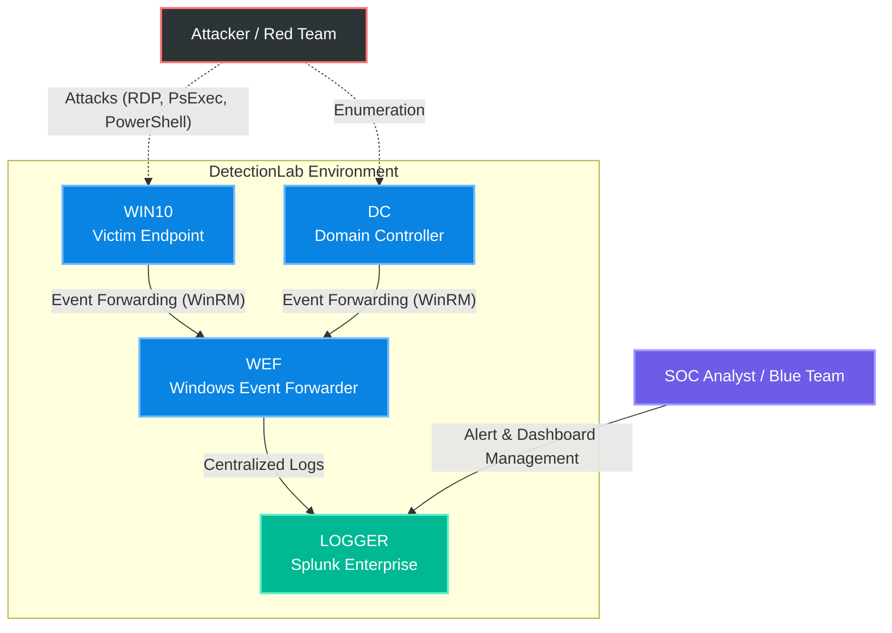

# SOC & Detection Engineering Lab

This project is a laboratory environment (DetectionLab) built to simulate real-world attacks on Windows systems, collect telemetry, and develop custom Detection and Alerting logic within a SIEM (Splunk).

## Project Objectives
- Configure a centralized logging infrastructure (Windows Event Forwarding -> Splunk).
- Simulate real attack techniques based on the MITRE ATT&CK framework.
- Develop **Detection as Code** by creating operational alerts and dashboards for a Security Operations Center (SOC).

---

## Architecture and Data Flow

The infrastructure is based on virtual machines managed via Vagrant. The laboratory logic is divided into two main flows:
1. **Offensive Flow:** The attacker targets endpoints (Win10) or the Domain Controller (DC). Malicious actions generate local logs.
2. **Defensive Flow:** Logs are forwarded via WinRM to the WEF (Windows Event Forwarder) server and finally centralized on Splunk (Logger). From here, the SOC team monitors events, manages alerts, and analyzes dashboards.

